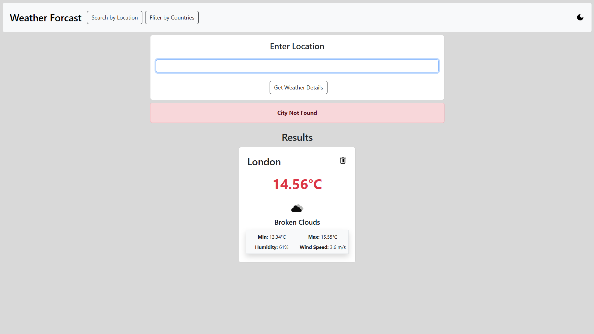

# 🌦️ Weather Forecast Application

A modern weather forecast application built with **React.js**, utilizing **JSON Server** and the **OpenWeather API** to provide accurate, real-time weather data. Users can search for weather conditions in specific cities, filter results by countries, toggle between light and dark themes, and navigate through paginated data effortlessly.

---

## 🚀 Features

- **Real-Time Weather Data**: Access up-to-date information, including temperature, humidity, wind speed, and weather conditions.
- **Search Functionality**: Instantly find the weather for any city by typing its name.
- **Filter by Country**: Narrow down results to view weather data for cities within a selected country.
- **Dark Mode**: Enjoy a sleek interface with light/dark mode toggling.
- **Pagination**: Seamlessly browse large datasets of weather data without overwhelming the interface.
- **Responsive Design**: Fully adaptable for both desktop and mobile users.

---

## 🛠️ Tech Stack

- **Frontend**: React.js
- **Backend**: JSON Server
- **API Integration**: OpenWeather API
- **Styling**: BOOTSTRAP 5

---

## 📷 Screenshots

### 1. Dashboard


### 2. Search by Location


### 3. Filter by Country with Dark Theme


### 4. Pagination with Dark Theme


---

## 🔠 Installation and Setup

Follow these steps to set up the project locally:

### 1. Clone the Repository
```bash
git clone https://github.com/your-username/weather-forecast-app.git
cd weather-forecast-app
```

### 2. Install Dependencies
```bash
npm install --force
```

### 3. Set Up the OpenWeather API
- Visit [OpenWeather API](https://openweathermap.org/api) to obtain your API key.
- Replace the placeholder `your-api-key` in the code with your actual API key:
  ```javascript
  REACT_APP_API_KEY = "your-api-key";
  ```

### 4. Run the Application
- Start the React app:
  ```bash
  npm start
  ```
- Launch the JSON Server in a separate terminal:
  ```bash
  npm run server
  ```

---

---

## 📙 Usage Guide

1. **Search for Weather**: Type the city name in the search bar to fetch the weather details.
2. **Filter by Country**: Use the dropdown menu to view cities within a specific country.
3. **Toggle Themes**: Switch between light and dark mode using the theme toggle button.
4. **Paginated Navigation**: Navigate through large sets of weather data using pagination controls.

---


Happy coding! 🌟
